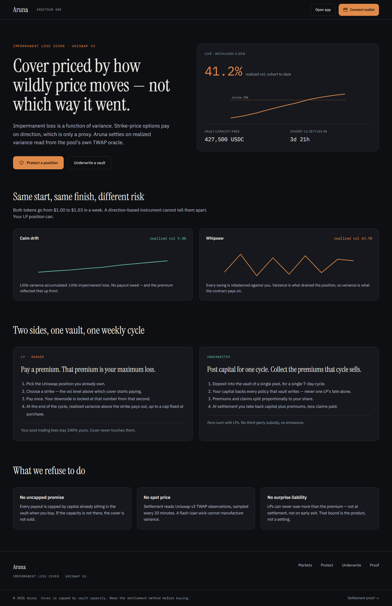

# Aruna

**Impermanent loss cover for Uniswap v3 LPs, priced by how wildly price moves — not which way it went.**

Aruna settles on realized variance read from a pool's own TWAP oracle, instead of strike-price direction like existing hedging instruments. LPs pay a premium that is also their maximum possible loss; underwriters post capital into a per-pool vault and collect that premium in return for backing the payout, capped by the capital actually sitting in the vault at the time cover is sold.

This repository is the frontend for Aruna — a Next.js application built for a buildathon submission. It does not contain the smart contracts.

## Preview



## How it works

- **LP side.** Pick the Uniswap v3 position you already own, choose a strike (the realized-volatility level above which cover starts paying), and pay a premium once. That premium is locked in as your maximum loss from that second — it cannot grow, not at settlement, not on early exit. Your pool trading fees stay entirely yours.
- **Underwriter side.** Deposit capital into a single pool's vault for a single weekly cycle. That capital backs every policy the vault writes that cycle, never one LP's fate alone. Premiums and claims split proportionally to your share of the vault.
- **Settlement.** Realized variance is computed from Uniswap v3 TWAP observations sampled every 30 minutes — never from spot price, so a flash-loan wick cannot manufacture a payout. Every payout is capped by capital that was already in the vault when the cover was bought; if the capacity isn't there, the cover isn't sold.

These are product principles, not implementation details specific to this repo — the contracts that enforce them live in a separate design/spec repository.

## Status

This is a **work-in-progress frontend build**, following the step-by-step plan in [`app/docs/guide.md`](app/docs/guide.md):

- [x] Design tokens (`lib/design-tokens.ts`, `app/globals.css`)
- [x] Shared component library (`components/aruna/`, inventory in [`components/aruna/README.md`](components/aruna/README.md))
- [x] Mock data, copy, and contract scaffolding (`lib/mock/`, `lib/content/`, `lib/contracts/`, `hooks/`)
- [x] Landing page (`/`)
- [ ] Markets, Protect (LP flow), Underwrite (vault flow), Proof, and edge-case states pages

Routes other than `/` are referenced in navigation but not yet built. `lib/contracts/addresses.ts` and the ABI files under `lib/contracts/abis/` are empty placeholders — no contract is deployed yet, and nothing in this UI reads from or writes to a live contract.

## Tech stack

- [Next.js 16](https://nextjs.org) (App Router) + React 19 + TypeScript
- [Tailwind CSS v4](https://tailwindcss.com) (CSS-first `@theme`, no `tailwind.config.js`)
- [wagmi](https://wagmi.sh) + [viem](https://viem.sh), configured for Arbitrum One — wired but not yet consumed (`hooks/` currently read from `lib/mock/`)

## Project structure

```
app/                    Routes (App Router). Only "/" (landing) exists so far.
components/aruna/       Shared presentational components — no data fetching, no lib/mock or lib/contracts imports.
hooks/                  useVaults, usePosition, useCohort, useQuote — read lib/mock today, will read wagmi later
                         without changing their return shape or any caller.
lib/design-tokens.ts    Colors, type scale, radius, spacing — mirrored as CSS variables in app/globals.css.
lib/content/            All product copy (lib/content/copy.ts) and copy rules/decisions (copy-rules.md).
lib/mock/               Fixture data for vaults, positions, cohorts, and settlement proof.
lib/contracts/          Addresses, ABIs, and wagmi config — placeholders until contracts are deployed.
types/                  Shared TypeScript types for components (aruna.ts) and domain data (domain.ts).
```

## Getting started

```bash
npm install
npm run dev
```

Open [http://localhost:3000](http://localhost:3000) to view the app.

```bash
npm run build   # production build
npm run lint    # eslint
```

## Disclaimer

Buildathon project. No contract in this stack is deployed to any network — every address in the UI is a placeholder. Do not send funds to any address shown here.
